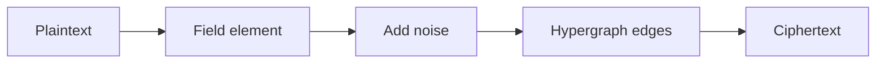

PVAC-HFHE is a proof-of-concept implementation of homomorphic fully homomorphic encryption (HFHE) based on the Learning Parity with Noise (LPN) assumption and arithmetic over a 127-bit prime field.

## Architecture

The scheme consists of four core components:

<CardGroup cols={2}>
  <Card title="Field arithmetic" icon="calculator" href="/concepts/field-arithmetic">
    127-bit prime field operations (p = 2^127 - 1)
  </Card>
  <Card title="Encryption scheme" icon="lock" href="/concepts/encryption-scheme">
    Hypergraph-based encryption with LPN security
  </Card>
  <Card title="Homomorphic operations" icon="function" href="/concepts/homomorphic-operations">
    Addition, subtraction, and multiplication on ciphertexts
  </Card>
  <Card title="Security" icon="shield" href="/concepts/security">
    128-bit security based on LPN hardness
  </Card>
</CardGroup>

## How it works

### Encryption flow



1. **Encode**: Convert plaintext values to field elements in Fp
2. **Add noise**: Generate noise using PRF based on LPN
3. **Build hypergraph**: Create syndrome graph with random edges
4. **Output ciphertext**: Layers and edges representing encrypted value

### Homomorphic computation

<Note>
All operations preserve the algebraic structure, allowing computation on encrypted data without decryption.
</Note>

```cpp
// Encrypt values (client-side)
Cipher a = enc_value(pk, sk, 42);
Cipher b = enc_value(pk, sk, 17);

// Homomorphic operations (server-side)
Cipher sum  = ct_add(pk, a, b);  // 42 + 17 = 59
Cipher diff = ct_sub(pk, a, b);  // 42 - 17 = 25
Cipher prod = ct_mul(pk, a, b);  // 42 * 17 = 714

// Decrypt results (client-side)
uint64_t result = dec_value(pk, sk, sum);
```

## Key structures

### Ciphertext

A ciphertext consists of:

- **Layers** (`L`): Computational graph nodes, either BASE or PROD (multiplication)
- **Edges** (`E`): Hypergraph edges with weights and syndrome vectors
- **Constant term** (`c0`): Plaintext additive constant
- **Slots**: Number of packed values (for batching)

```cpp
struct Cipher {
    std::vector<Layer> L;     // Computational layers
    std::vector<Edge> E;      // Hypergraph edges
    std::vector<Fp> c0;       // Constant term
    size_t slots = 1;         // Number of slots
};
```

### Public key

The public key contains:

- **Parameters** (`prm`): Security and performance parameters
- **Hypergraph matrix** (`H`): Dense random binary matrix
- **Generator powers** (`powg_B`): Precomputed powers g^0, g^1, ..., g^(B-1)
- **Primitives**: Root of unity (ω_B) for multiplicative group

### Secret key

The secret key is compact:

- **PRF key** (`prf_k`): 256-bit key for pseudorandom functions
- **LPN secret** (`lpn_s_bits`): Binary vector for LPN instance

<Info>
The secret key is only 256 + 4096 bits = **544 bytes**, while the public key is ~8 MB.
</Info>

## Performance characteristics

| Operation | Time | Ciphertext size |
|-----------|------|----------------|
| Key generation | 859 ms | PK: 8 MB, SK: 544 B |
| Encryption | 84 ms | 42 KB (fresh) |
| Decryption | 13 ms | - |
| Addition | 0.012 ms | No growth |
| Multiplication | 2.47 ms | Grows with depth |

<Warning>
This is a proof-of-concept implementation. Ciphertext size grows exponentially with multiplicative depth.
</Warning>

## Design philosophy

### Why hypergraphs?

The scheme uses a dense random k-uniform hypergraph to construct syndrome graphs. This approach is based on:

- **Threshold behavior** of random hypergraphs
- **Fractional colorability** results from Moscow Institute of Physics and Technology (MIPT)
- **LPN hardness** for security guarantees

### Trade-offs

**Advantages:**
- Fast scalar operations (2.9-14.3× faster multiplication vs RLWE schemes)
- Small fresh ciphertexts (6-85× smaller than BFV/BGV/CKKS)
- No NTT-friendly prime requirements (works with arbitrary uint64)
- Exact arithmetic (no approximation errors)

**Limitations:**
- Ciphertext growth with depth (exponential in this PoC)
- Slower key generation (22× vs BFV)
- No native SIMD (requires parallelization)
- Less studied security assumption (LPN vs RLWE)

## Next steps

<CardGroup cols={2}>
  <Card title="Field arithmetic" icon="calculator" href="/concepts/field-arithmetic">
    Learn about the 127-bit prime field
  </Card>
  <Card title="Encryption scheme" icon="lock" href="/concepts/encryption-scheme">
    Understand the hypergraph construction
  </Card>
  <Card title="Getting started" icon="rocket" href="/quickstart">
    Build your first encrypted computation
  </Card>
  <Card title="API reference" icon="code" href="/api-reference">
    Explore the complete API
  </Card>
</CardGroup>
